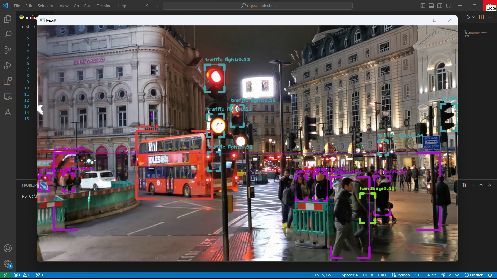
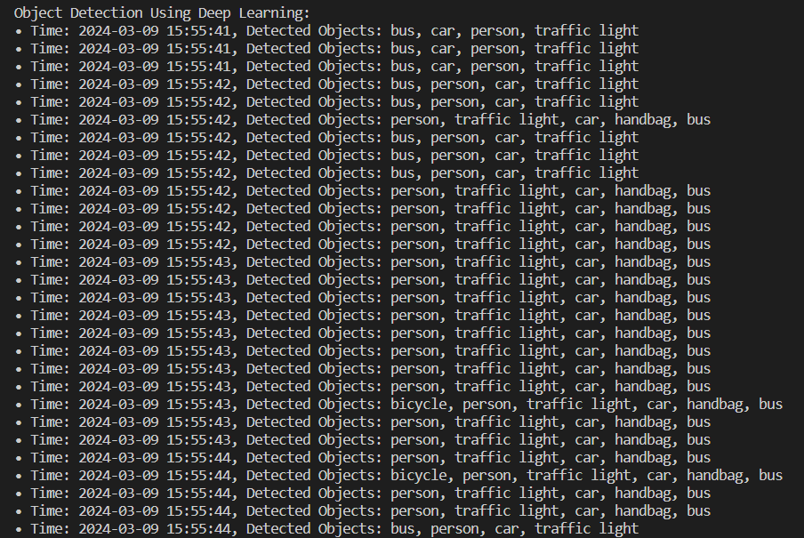
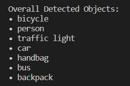
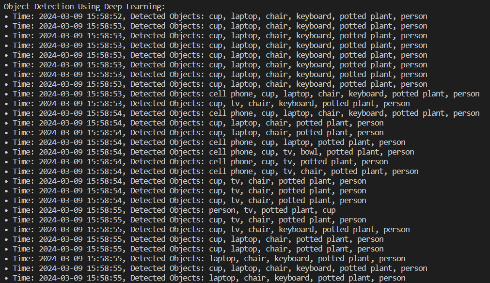
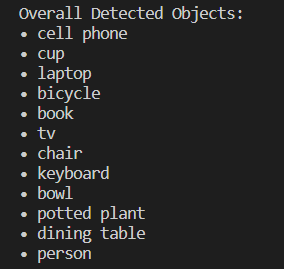

# Object Detection Using Deep Learning

## Project Overview
This project demonstrates **real-time object detection** using deep learning techniques. It employs the **OpenCV** library and the **SSD MobileNet** pre-trained model to detect objects in video streams. The primary focus is on identifying, localizing, and tracking objects in real-time scenarios such as video surveillance, autonomous vehicles, and more.

## Features
- **Real-time object detection** from video input.
- **Pre-trained SSD MobileNet model** for fast and efficient object detection.
- **Logging mechanism** that records detected objects with timestamps.
- **Customizable configurations** for video path, model settings, and log file output.

## Technologies Used
- **Python**: The primary programming language for the implementation.
- **OpenCV**: Used for real-time computer vision tasks such as video capture and processing.
- **SSD MobileNet**: A combination of the Single Shot Multibox Detector (SSD) and MobileNet architectures, enabling real-time object detection.
- **Convolutional Neural Networks (CNNs)**: Applied to identify and classify objects within the video stream.

## Methodology
1. **Object Detection**: The code processes each frame of the video, applies the SSD MobileNet model, and detects objects within the frame.
2. **Video Processing**: The video frames are resized, and the model processes them to identify objects. Bounding boxes and class labels are assigned to each detected object.
3. **Non-Maximum Suppression (NMS)**: This step filters out redundant bounding boxes, ensuring only the most confident detections are retained.
4. **Logging**: Detected objects and their respective timestamps are logged into a file for reference.

### Object Detection Workflow:
1. Load the pre-trained **SSD MobileNet** model.
2. Pass the video stream frame-by-frame through the model.
3. Detect objects and display bounding boxes on the frame.
4. Apply **Non-Maximum Suppression** to eliminate redundant bounding boxes.
5. Log the detected objects with timestamps for each frame.

## Results
The object detection model efficiently detects objects in real-time with high accuracy. Below are sample results from the project:

### Sample Output 1

|  |  |
|:------------------------------------------------:|:------------------------------------------------:|

### Sample Output 2

|  |  |
|:------------------------------------------------:|:------------------------------------------------:|

The results show the successful detection of multiple objects in a live video stream, with bounding boxes and labels clearly marking each detected object.

---

